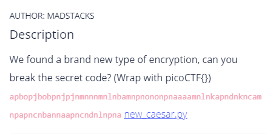

# New Caesar
### Authored by Katrina Lee



## Think

If we take a look at the provided [new_caesar.py](new_caesar.py) file, we can see how the ciphertext was generated. [Here](new_caesar_annotated.py) is an annotated version of the encryption code, so that you can see what it's doing to the plaintext.

## Solve

Now that we know how the encryption works, we can write our own script to get the original plaintext. First, let's import the base64 module: `import base64`. Then, we need to set our alphabet and ciphertext variables. Let's just write out the 16-letter alphabet for simplicity:
```
given = "apbopjbobpnjpjnmnnnmnlnbamnpnononpnaaaamnlnkapndnkncamnpapncnbannaapncndnlnpna"
ALPHABET = list("abcdefghijklmnop")
```

To reverse the source code's `b16_encode(plain)` function, we need to first create the `enc` variable by separating the ciphertext into chunks of 2, because, remember, in the [new_caesar.py](new_caesar.py), two characters (lines 10 & 11) were added to the `enc` string for every character in the plaintext. So, every chunk of 2 will be later converted into one character of the plaintext. We can do this with the following: `enc = [ciph[i * 2:(i + 1) * 2] for i in range((len(ciph) + 2 - 1) // 2)]`.

Next, let's iterate over every chunk in `enc` and do the following:
* get the first half of the `binary` variable
	* using the first character of this chunk, get its index in `ALPHABET`: `ALPHABET.index(i[0])`
	* turn this decimal value into 4-bit binary: `bin1 = "{0:04b}".format(ALPHABET.index(i[0]))`
* repeat to get the second half of `binary`
* combine them: `binary = bin1 + bin2`
* get the character that will be added to `plain`: `c = chr(int(binary, 2))`
* add the character to `plain`: `plain += c`

I've tried my best to copy the variable names used in the original encryption source code to make it easier to follow along.

Okay, now we're done reversing the base 16 part. The next step is to print out all the possible flags. We can first initialize an empty array: `possible_flags = []`. Then, loop through each of the letters in `ALPHABET`, and perform a Caesar Cipher on each character in the `given` string with that letter as the key / shift. If you're stuck, you can take a look at my code linked below.

Running the script gives us a list of 16 possible flags, generated with each of the 16 possible keys in our shortened alphabet. There are only a few that are composed of entirely human-readable / ASCII printable characters. The one that starts with `et_tu?` is likely to be the flag because it is a reference to the Latin phrase, `Et tu, Brute?`, a quote from Shakespeare's play, *Julius Caesar*.

And...we got the flag! `picoCTF{et_tu?_23217b54456fb10e908b5e87c6e89156}`

## Resources

* [Python String format() Method](https://www.w3schools.com/python/ref_string_format.asp)


You can find the full script below or [here](new_caesar_solution.py) as a file.

```
import base64

given = "apbopjbobpnjpjnmnnnmnlnbamnpnononpnaaaamnlnkapndnkncamnpapncnbannaapncndnlnpna"
ALPHABET = list("abcdefghijklmnop")

def b16_decode(ciph):
	plain = ""
	ciph = list(ciph)
	enc = [ciph[i * 2:(i + 1) * 2] for i in range((len(ciph) + 2 - 1) // 2)]
	for i in enc:
		bin1 = "{0:04b}".format(ALPHABET.index(i[0]))
		bin2 = "{0:04b}".format(ALPHABET.index(i[1]))
		binary = bin1 + bin2
		c = chr(int(binary, 2))
		plain += c
	return plain

possible_flags = []

for key in ALPHABET:
	enc = ""

	for i in given:
		c = ALPHABET.index(i) + 194 - ord(key)
		f = 1
		while c not in range(97, 113):
			c = ALPHABET.index(i) + 194 - ord(key) + 16 * f
			f += 1
		enc += chr(c)

	possible_flags.append(b16_decode(enc))

print("\n".join(possible_flags))
```
